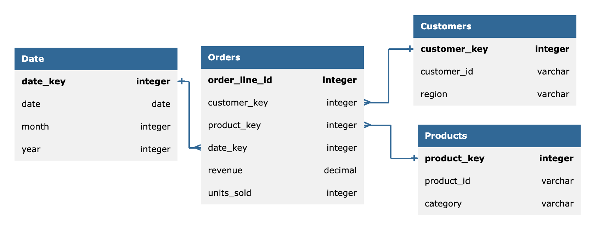

import ResponsiveTable from '@/components/ResponsiveTable.astro';


**“Ask your database”** is quickly becoming a non-negotiable feature in modern BI systems. From small teams to large enterprises, analysts expect to query data in natural language, without needing to understand SQL or underlying schemas, and get answers instantly.  

The promise is simple. Making it reliable in production is not.  

## Table of contents

## Modelling the problem and Analyzing Failure Modes
Assume we are dealing with the following data model and a user asks:


> [!EXAMPLE] Natural Language Query:
> Show me the top 3 product categories by revenue for customers in the US region, who signed up after 2025, excluding orders with less than 2 units, for the last quarter

The solution can be modelled if we:
1.  Capture the user's natural language query
2.  Inject database schema context (tables, fields, relationships, sometimes sample data)
3.  Prompt the LLM to translate the query into SQL
4.  Execute the generated SQL against the database

Looks like a simple task at first, until we start investigating the failure modes:

{/* 

Rich context—including schema metadata, business definitions, relationships, and documentation—works surprisingly well at first glance. However, relying on ever-growing context introduces its own set of challenges.

#### Context doesn't scale 
Keeping schema descriptions, business definitions, and documentation synchronized becomes increasingly difficult as databases evolve.

#### Garbage in, garbage out
Outdated or contradictory documentation propagates directly into the model's reasoning, leading to incorrect SQL.

#### Retrieval quality matters
Large databases rarely fit into a single prompt. Missing the relevant schema or business context often produces incorrect SQL. Larger prompts introduce more irrelevant information, increasing the likelihood of semantic misunderstandings and hallucinations. */}
### Answering the wrong question

for the discussed query, the following ambiguities may arise:

<ResponsiveTable variant="striped-minimal">
| Requirement | Hidden ambiguity | Possible mistake |
|---|---|---|
| Revenue | Which metric? Gross, net, after discounts? | Uses the wrong revenue column |
| Product categories | Which category hierarchy? | Groups at the wrong level |
| US region | Billing, shipping, or customer location? | Filters the wrong customers |
| Signed up after 2025 | Exact date and timezone? | Applies the wrong date filter |
| Orders with ≥2 units | Order-level or item-level quantity? | Filters incorrectly |
| Last quarter | Calendar or fiscal quarter? | Uses the wrong date range |
| Top 3 | Ranked by revenue, orders, or something else? | Returns the wrong results |
</ResponsiveTable>
---

### Performance Issues

So for the discussed query, the following ambiguities may arise :
> [!EXAMPLE] Natural Language Query:
> Show me the top 3 product categories by revenue for customers in the US region, who signed up after 2025, excluding orders with less than 2 units, for the last quarter

> [!WARNING]+ Illustrative example only 
> This SQL was generated using **GPT-5** for demonstration purposes. LLMs are **non-deterministic**, and different models—or even different runs of the same model—may produce entirely different SQL.
```sql
-- Example query generated by LLM
SELECT
    p.category,
    SUM(oi.quantity * oi.unit_price) AS revenue
FROM orders o
JOIN order_items oi
    ON o.id = oi.order_id
JOIN products p
    ON oi.product_id = p.id
JOIN customers c
    ON o.customer_id = c.id
WHERE
    YEAR(o.order_date) = 2026
    AND QUARTER(o.order_date) = 2
    AND c.region = 'US'
    AND c.signup_date > '2025-01-01'
GROUP BY p.category
HAVING SUM(oi.quantity) >= 2
ORDER BY revenue DESC
LIMIT 3;
```

<ResponsiveTable variant="striped-minimal">
| Issue | What's wrong? | Better approach |
| --- | --- | --- |
| **Non-sargable predicate** | `YEAR(order_date)` and `QUARTER(order_date)` prevent index usage. | Filter using a date range (`order_date >= ... AND order_date <ResponsiveTable ...`). |
| **Late aggregation filter** | `HAVING SUM(quantity) >= 2` filters after grouping every category. If the requirement is to exclude small **orders**, the filter should happen before aggregation. | Filter qualifying orders before computing revenue. |
| **Incorrect aggregation semantics** | `SUM(quantity) >= 2` checks the total quantity per category, not whether each order contains at least 2 units. | Aggregate at the order level first, then roll up to categories. |
| **Inefficient join order** | All `order_items` are joined before restricting to the relevant customers and time period. | Filter orders and customers first to reduce rows flowing into the joins. |
| **Missing partition pruning** | Applying functions to `order_date` may prevent partition elimination on partitioned tables. | Use range predicates on the partition key. |
</ResponsiveTable>

> [!INFO]+ **What does SARG mean?**
> **SARG** stands for **Search ARGument**. A predicate is **sargable** when the database engine can efficiently use an index to satisfy the condition. Operations such as `YEAR(order_date)`, `LOWER(email)`, `DATE(created_at)`, or arithmetic expressions on indexed columns typically make predicates **non-sargable**, forcing the optimizer to scan significantly more data than necessary.


```sql
-- Non-sargable
WHERE YEAR(order_date) = 2025
```

```sql
-- Sargable
WHERE order_date >= '2025-01-01'
  AND order_date < '2026-01-01'
```

---

### Security Risks
Generating SQL directly from natural language introduces a new attack surface. Unlike traditional applications where queries are carefully authored and reviewed, LLM-generated SQL must defend against ambiguous requests, malicious prompts, and accidental misuse.

> [!WARNING]+ Illustrative example only 
> This SQL was generated using **GPT-5** for demonstration purposes. LLMs are **non-deterministic**, and different models—or even different runs of the same model—may produce entirely different SQL.

```sql
-- User: "Show me all customer information for users in the US."

SELECT
    c.*,
    cc.card_number,
    cc.cvv,
    ssn.ssn,
    a.api_key
FROM customers c
LEFT JOIN credit_cards cc
    ON c.id = cc.customer_id
LEFT JOIN customer_ssn ssn
    ON c.id = ssn.customer_id
LEFT JOIN api_keys a
    ON c.id = a.customer_id
WHERE c.country = 'US';
```

<ResponsiveTable variant="striped-minimal">
| Issue | What's wrong? | Better approach |
| --- | --- | --- |
| **Unauthorized data access** | Uses `SELECT *` and joins sensitive tables containing payment information, SSNs, and API keys that were never requested. | Restrict access using role-based permissions and only expose approved columns. |
| **Data exfiltration** | Returns significantly more data than the user asked for, including sensitive information. | Return only the fields required to answer the user's question. |
| **Prompt injection** | A malicious prompt could instruct the model to ignore previous restrictions and query sensitive tables. | Separate authorization from prompting and validate every generated query before execution. |
| **Destructive queries** | A model could generate `UPDATE`, `DELETE`, `DROP`, or `ALTER` statements if prompted. | Execute generated SQL using read-only credentials or allowlisted query types. |
| **Denial of service** | Similar queries using large cross joins or unbounded scans can consume excessive CPU, memory, and I/O. | Apply query timeouts, row limits, resource quotas, and cost-based validation before execution. |
</ResponsiveTable>