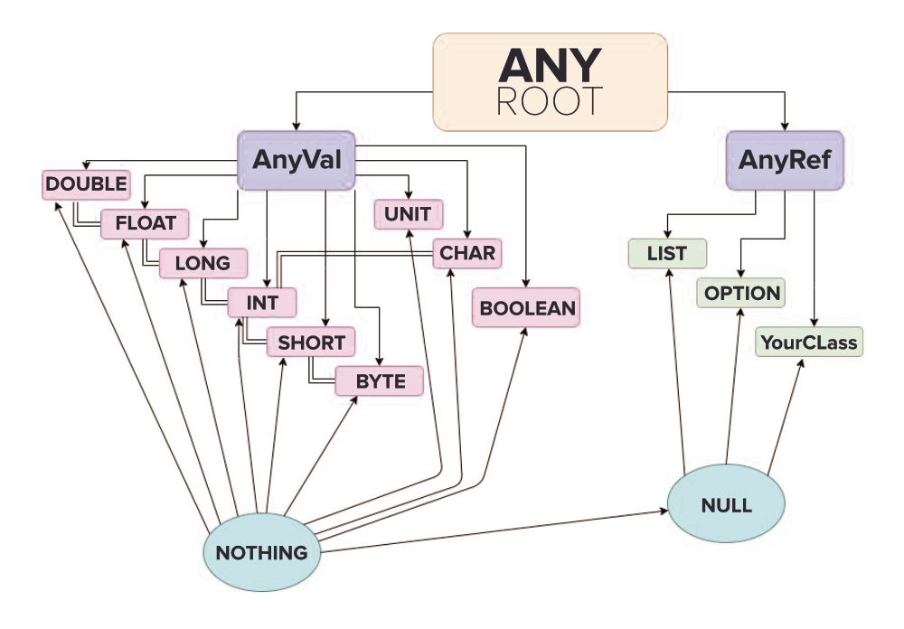

# Unified Type System in Scala


In Scala, the **Unified Type System** means that there is a single root type from which every other type inherits. This root type is `Any`, making every value and object in Scala part of the same type hierarchy.

The `Any` class has two direct subclasses:

- `AnyVal`
- `AnyRef`



## `AnyVal`

`AnyVal` is the parent class of all **value types**. These are non-nullable types that represent primitive values.

The predefined value types are:

- `Double`
- `Float`
- `Long`
- `Int`
- `Short`
- `Byte`
- `Char`
- `Boolean`
- `Unit`

## `AnyRef`

`AnyRef` is the parent class of all **reference types**. Every user-defined class in Scala implicitly extends `AnyRef`.

On the JVM, `scala.AnyRef` corresponds to Java's `java.lang.Object`.

## Why does Scala separate `AnyVal` and `AnyRef`?

Since Scala runs on the **Java Virtual Machine (JVM)**, it needs to distinguish between **value types** and **reference types**.

Unlike languages such as Java or C, Scala does not expose primitive types directly. Instead, these types are represented as subclasses of `AnyVal`, giving them a consistent place in the type hierarchy while still allowing the compiler to optimize them efficiently.

Because of this unified hierarchy:

- Every type ultimately inherits from `Any`.
- Value types cannot be instantiated using the `new` keyword.
- Reference types can be instantiated using `new`.

The following diagram illustrates the relationship between the root type, value types, and reference types.

- **Arrows** represent inheritance.
- **Double lines** represent the hierarchy and implicit type conversions.

## Advantages of the Unified Type System

The unified type system provides several benefits:

- Greater type safety compared to traditional type systems.
- Easier interoperability with objects created in other JVM languages.
- Every value has access to universal methods such as:
  - `equals`
  - `hashCode`
  - `toString`

These methods are available because every type ultimately inherits from `Any`, where these common operations are defined.

## Example

The following example demonstrates how the unified type system allows values of different types to coexist in the same collection.

```scala
// Scala Program to print common elements
// from 2 lists

object Geek {

    def main(args: Array[String]) {

        // Creating a list with a fixed data type
        val GfG: List[String] =
            List("Geeks", "for", "Geeks")

        // Creating a list containing
        // different data types using Any
        val myList: List[Any] = List(
            "Geeks",
            "for",
            "Geeks",
            1000,
            525
        )

        myList.foreach(value => {

            // contains() is a universal function
            if (GfG.contains(value)) {
                println(value)
            }
        })
    }
}
```

### Output

```text
Geeks
for
Geeks
```

## Explanation

In this example:

- `GfG` is a `List[String]`, meaning it can only contain strings.
- `myList` is a `List[Any]`, allowing it to store values of different types because `Any` is the root of Scala's type hierarchy.

The program iterates through `myList` and checks whether each element exists in `GfG` using the `contains()` method.

Since `contains()` is available on Scala collections and all values participate in the unified type system, values of different types can be processed consistently while preserving type safety.

This unified approach makes Scala expressive, robust, and particularly well suited for functional programming and large-scale data processing applications.